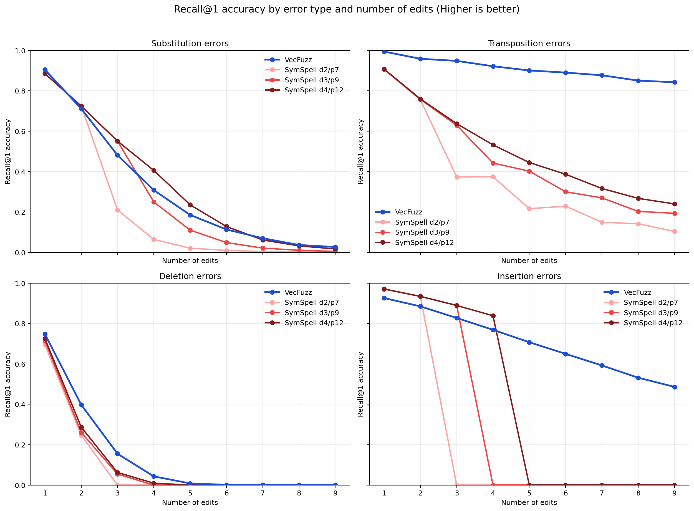
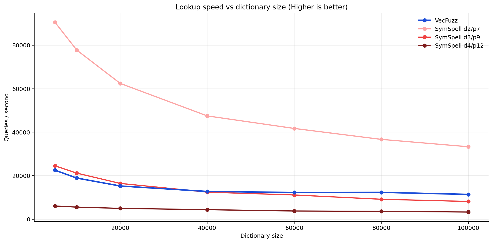
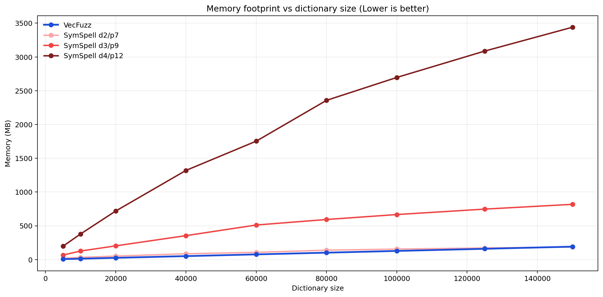
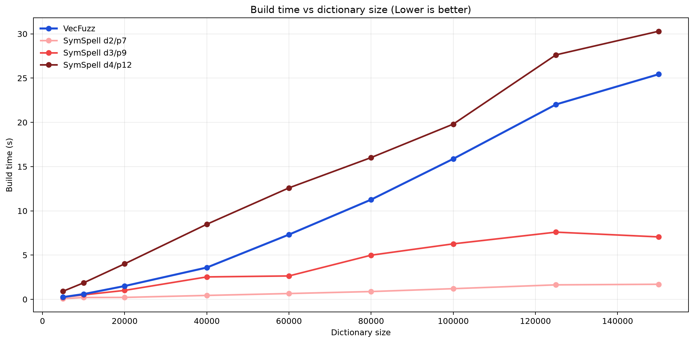

# VecFuzz: Vector-based Fuzzy Matching

[](https://opensource.org/licenses/MIT)
[](https://www.python.org/downloads/)

A **fast approximate string matching library** that turns words into compact vectors so you can find the closest match, even when the query is riddled with typos! It’s a fuzzy matching on steroids: sub‑millisecond lookup times and linear memory scaling.


## The trade-off

Fuzzy matching has a three-way tension between speed, memory, and accuracy. VecFuzz dominate on speed and memory, while remaining competitive on accuracy. What it does:

- **Memory stays flat** as typo-tolerance increases. SymSpell's index size grows combinatorially with max edit distance (its d4/p12 config hits ~3.5GB at 160k words); VecFuzz's stays under ~135MB regardless of how many edits you want to tolerate.
- **Query speed stays high** relative to brute-force comparison methods. RapidFuzz and raw Levenshtein score every candidate per query; VecFuzz searches an ANN index instead, ~100x+ faster in my tests.
- **Accuracy is competitive** but not best-in-class. On real human misspellings, both RapidFuzz and SymSpell beat VecFuzz on Recall@1. VecFuzz's real strength shows up on insertion and transposition-heavy errors, where it clearly outperforms SymSpell.

If your dictionary is large, your memory budget is tight, and your queries need to be fast, VecFuzz gives up a few points of recall for a large win on the other two axes. If you have the memory and time budget for SymSpell d4 or RapidFuzz, they'll edge it out on pure accuracy.


## How it works

Each word is converted into a fixed-length vector with four sub-components:

1. **Character frequency:** how often each letter appears.
2. **Average character position:** where each character tends to appear in the word.
3. **Preceding-character influence:** a distance-decayed contribution from earlier characters.
4. **Succeeding-character influence:** a distance-decayed contribution from later characters.

All four are normalized by word length, so "apple" and "apples" land close together. The sub-vectors are concatenated and indexed with FAISS HNSW under Manhattan (L1) distance; a query is vectorized the same way and the nearest neighbours in the index become your top-k candidates.


## Benchmark Highlights

### Synthetic edit-distance sweep

Dictionary of 100k words, compared against SymSpell at three delete-distance/prefix-length configs (d2/p7, d3/p9, d4/p12). Tested on a Ryzen 9 365.

- **Recall@1 by error type and edit count**:
  - *Insertions*: VecFuzz clearly wins and degrades gracefully, still >40% recall at 9 insertion edits, where every SymSpell config has already dropped to 0 once edits exceed its configured max distance.
  - *Swaps/transpositions*: VecFuzz starts near-perfect and stays well above all SymSpell configs at every edit count.
  - *Deletions*: Roughly comparable to SymSpell, both degrade quickly past 2–3 edits.
  - *Substitutions*: This is VecFuzz's weak point, SymSpell d3/d4 clearly outperform it, especially at 1–3 edits.


- **Lookup speed**: SymSpell d2/p7 is fastest by a wide margin; VecFuzz sits in the middle, ahead of SymSpell d3/p9 and d4/p12.


- **Memory**: VecFuzz grows roughly linearly and stays lowest across all sizes tested; SymSpell d4/p12 grows the fastest, reaching ~2.7GB at 100k words vs VecFuzz's <100MB.


- **Build time**: VecFuzz is faster to build than SymSpell d4/p12, slower than the lower-order SymSpell configs.


### Real-world human errors (Birkbeck Spelling Error Corpus)

Dictionary ~160k words, non-synthetic human misspellings (includes phonetic errors, dysgraphia, multi-error handwriting slips). Tested on a Ryzen 9 365.

| Method          | Recall@1 (%) | Recall@5 (%) | Recall@10 (%) | Recall@25 (%) | Recall@100 (%) | Duration (s) | Build (s) | Size (MB) |
|-----------------|--------------|--------------|---------------|---------------|----------------|--------------|-----------|-----------|
| SymSpell d2/p7  | 34.05% 🥇    | 48.92% 🥉   | 51.94%        | 54.58%        | 57.70%         | 7.047s 🥈    | 1.857s    | 190.88 MB |
| VecFuzz         | 31.94% 🥉    | 49.92% 🥈   | 56.36% 🥈     | 64.29% 🥈    | 73.51% 🥈      | 3.297s 🥇    | 26.546s   | 134.60 MB |
| RapidFuzz       | 32.64% 🥈    | 51.74% 🥇   | 58.54% 🥇     | 66.56% 🥇    | 76.67% 🥇      | 409.564s 🥉  | N/A       | N/A       |
| Levenshtein     | 28.10%       | 46.73%       | 54.20% 🥉     | 62.64% 🥉    | 72.35% 🥉      | 454.533s     | N/A       | N/A       |

Takeaways:
- RapidFuzz has the best recall at every k, but takes ~124x longer per query than VecFuzz here.
- VecFuzz has the smallest memory footprint and the fastest query time of any method.
- VecFuzz sits second-best on Recall@5 through Recall@100, ahead of SymSpell.


## Installation

No pip package yet, the project is under active development. Import it directly as `from vecfuzz import VecFuzz` after placing `vecfuzz.py` and `faiss_index.py` in your working directory.
Clone or download this repository, make sure you have Python 3.8 or newer, and install the required dependencies.

### Dependencies:

- `faiss-cpu` (or `faiss-gpu` if you have an NVIDIA GPU and CUDA)
- `numpy`

Install everything with:

```bash
pip install -r requirements.txt
```

## Quick Start

The repository includes examples files that you can run immediately under `/examples`. Note that `vecfuzz.py` must be in the same directory. Below is a compact walk‑through.

```python
from vecfuzz import VecFuzz

words = ["apple", "banana", "orange", "peach", "pineapple"]

vf = VecFuzz()
index = vf.build_index(words)

queries = ["aple", "bannana", "orng"]
results = index.lookup(queries, k=3)

for query, candidates in results:
    print(f"Candidates for '{query}':")
    for candidate, distance in candidates:
        print(f"  -> {candidate} (L1 distance: {distance:.4f})")
```

Actual output on this repo's code:

```
Candidates for 'aple':
  -> apple (L1 distance: 4.0879)
  -> pineapple (L1 distance: 18.8328)
  -> peach (L1 distance: 19.9901)
Candidates for 'bannana':
  -> banana (L1 distance: 3.5214)
  -> orange (L1 distance: 29.2208)
  -> peach (L1 distance: 32.7987)
Candidates for 'orng':
  -> orange (L1 distance: 9.7637)
  -> banana (L1 distance: 26.2858)
  -> apple (L1 distance: 30.1436)
```

To save and load an index:

```python
from faiss_index import FaissIndex
index = VecFuzz().build_index(["..."])
index.save("index.zip")

# later, or in another process
from faiss_index import FaissIndex
index = VecFuzz().load_index("index.zip")
```


## When to use this

- Large dictionaries where SymSpell-style precomputed edit indexes get too large to fit in memory.
- Interactive/high-QPS fuzzy search where brute-force comparison (RapidFuzz, raw Levenshtein) is too slow.
- Workloads dominated by insertions or transpositions.


## When not to use this

- Workloads dominated by substitution errors, where SymSpell or RapidFuzz will give meaningfully better recall.
- Small dictionaries where memory isn't a constraint and you can afford brute-force accuracy.


## Contributing

Early-stage project — issues and PRs welcome, especially around closing the substitution-error gap. Keep the code clean, the docs plain, and the benchmarks honest.


## License

MIT. Use it, modify it, ship it. Keep the copyright notice.
